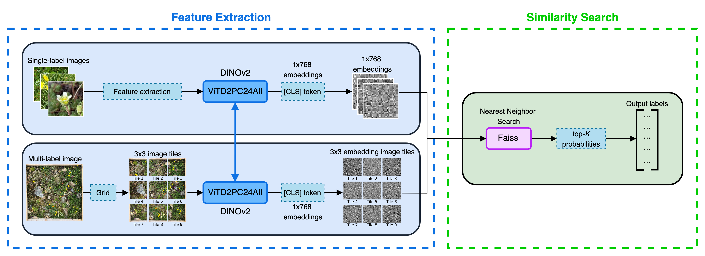

# PyTorch PlantCLEF: Multi-label Plant Species Classification with DINOv2


**PyTorch webinar** on using the **[DINOv2](https://dinov2.metademolab.com/)** model and the **[Faiss](https://ai.meta.com/tools/faiss/)** library for multi-label plant species classification in the [**PlantCLEF @ LifeCLEF & CVPR-FGVC**](https://www.kaggle.com/competitions/plantclef-2025) competition on Kaggle.
This session will demonstrate how **self-supervised Vision Transformers (ViTs)** and **similarity search techniques** can classify plant species efficiently at scale.



This webinar is made possible through the support of the [**PyTorch Foundation**](https://pytorch.org/foundation) and [**Intel AI**](https://www.intel.la/content/www/xl/es/artificial-intelligence/overview1.html).

## Watch the Webinar on YouTube

▶️ [**Click here to watch on YouTube**](https://www.youtube.com/watch?v=rxVg3yrc51s)

Discover how we used **DINOv2** + **Faiss** leveraging **[PyTorch](https://pytorch.org/)** and **[PyTorch Lightning](https://lightning.ai/docs/pytorch/stable/)** for large-scale multi-label plant species classification.

<div align="center">
  <a href="https://www.youtube.com/watch?v=rxVg3yrc51s"> 
  </a> 
</div>

<!-- TABLE OF CONTENTS -->
<details>
  <summary>Table of Contents</summary>
  <ol>
    <li><a href="#what-youll-learn">What You'll Learn</a></li>
    <li><a href="#event-details">Event Details</a></li>
    <li>
      <a href="#quickstart-guide">Quickstart Guide</a>
      <ul>
        <li><a href="#1-clone-the-repository">1. Clone the repository</a></li>
        <li><a href="#2-install-uv-fast-package-manager">2. Install uv (Fast Package Manager)</a></li>
        <li><a href="#3-create-a-virtual-environment">3. Create a Virtual Environment</a></li>
        <li><a href="#4-install-dependencies-and-set-up-the-project">4. Install Dependencies and Set Up the Project</a></li>
        <li><a href="#5-download-dataset-&-fine-tuned-vit-model">5. Download Dataset & Fine-Tuned ViT Model</a></li>
        <li><a href="#6-run-tests-to-verify-setup">6. Run tests to verify setup</a></li>
      </ul>
    </li>
    <li><a href="#intel-tiber-ai-cloud-setup">Intel Tiber AI Cloud Setup</a></li>
  </ol>
</details>

## What You’ll Learn

- How to leverage **DINOv2 embeddings** for multi-label classification using **transfer learning**.
- Efficient **feature extraction** from a subset of **1.4M+ images** using **PyTorch Lightning**.
- Using **Faiss** for fast **nearest neighbor search** on high-dimensional embeddings.
- Image processing techniques: **grid-based tiling** and **prediction aggregation** to handle large datasets.

## Event Details

📅 **Date:** March 27th, 12 PM PST

🎤 **Speaker:** Murilo Gustineli

📍 **Where:** Online Webinar

👋 **Register today:** [Registration Page](https://hubs.la/Q03bRFQb0)

## Quickstart Guide

### 1. Clone the repository

First, clone the [**`pytorch-plantclef`**](https://github.com/murilogustineli/pytorch-plantclef) repo:

⚠️ **Using HTTPS** _(Recommended for Intel Tiber AI Cloud)_:

```bash
git clone https://github.com/murilogustineli/pytorch-plantclef.git
```

**Using SSH**:

```bash
git clone git@github.com:murilogustineli/pytorch-plantclef.git
```

Navigate to the project directory:

```bash
cd pytorch-plantclef
```

### 2. Install `uv` (Fast Package Manager)

Install `uv` as the package manager for the project. Follow the `uv` [installation instructions](https://docs.astral.sh/uv/getting-started/installation/) for macOS, Linux, and Windows.

If running on [Intel Tiber AI Cloud](https://ai.cloud.intel.com/), install `uv` as the following (also works for macOS and Linux):

```bash
curl -LsSf https://astral.sh/uv/install.sh | sh
```

Add it to `PATH`:

```bash
source $HOME/.local/bin/env
```

Check `uv` installation:

```bash
uv --version
```

### 3. Create a Virtual Environment

Create the virtual environment:

```bash
uv venv venv
```

Activate the virtual environment:

```bash
source venv/bin/activate
```

### 4. Install Dependencies and Set Up the Project

Install the `plantclef` package in **_editable mode_**, which means changes to the Python files will be immediately available without needing to reinstall the package.

Install all dependencies from `requirements.txt` to the `venv` virtual environment:

```bash
uv pip install -e .
```

This command does two things:

1. Installs all dependencies listed in `requirements.txt`.
2. Sets up `plantclef` as an **editable package** inside the virtual environment.

#### **[OPTIONAL] Set Up Pre-Commit Hooks for Code Formatting:**

To ensure code follows best practices, install `pre-commit`:

```bash
pre-commit install
```

This automatically formats and checks your code before every commit.

### 5. Download Dataset & Fine-Tuned ViT Model

Run the following script to download:

- **Dataset** (`data/parquet/dataset_name`)
- **Fine-Tuned DINOv2 Model** (`model/pretrained_models/model_name`)

```bash
bash scripts/download_data_model.sh
```

This script will:

- Download the dataset & model from Google Drive.
- Extract the `.zip` files into their respective directories.
- Remove the original `.zip` files to save space.

### 6. Run tests to verify setup

After downloading the data and fine-tuned model, we can ensure everything is working correctly by running the following `pystest`:

```bash
pytest -vv -s tests/test_model.py
```

This test ensures that:

- The **virtual environment** is correctly set up.
- The **DINOv2 model** is correctly loaded.
- Image embeddings are generated without errors.

If you're **running locally**, you should be good to go! If you're running on **Intel Tiber AI Cloud**, follow the setup below.

## Intel Tiber AI Cloud Setup

⚠️ The **Jupyter** and **terminal** environments on ITAC are **NOT** synced. This means that installing packages or setting environment variables in one will not automatically apply to the other.

To ensure proper Intel GPU (`xpu`) access, follow these steps:

1. **Open the notebook:** Open the jupyter notebook `notebooks/setup_itac.ipynb`.
2. **Run cells sequentially:** Go through the notebook step by step.
3. **Restart the Kernel when required:** Running the cell `exit()` will restart the jupyter kernel to apply the installations.
4. **Verify that the Intel GPU (`xpu`) is being used:** At the end of the notebook execution, check the PyTorch version and device are correct. The expect output if Intel GPU is enabled is:

   ```
   PyTorch Version: 2.5.1+cxx11.abi
   Using device: xpu
   ```

   If you see `Using device: cpu`, the setup did not correctly enable the Intel GPU—retry running the setup notebook.
